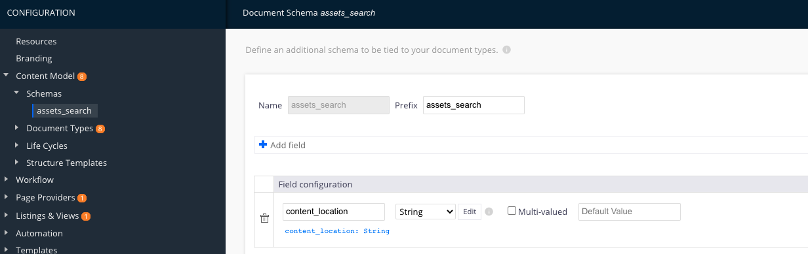
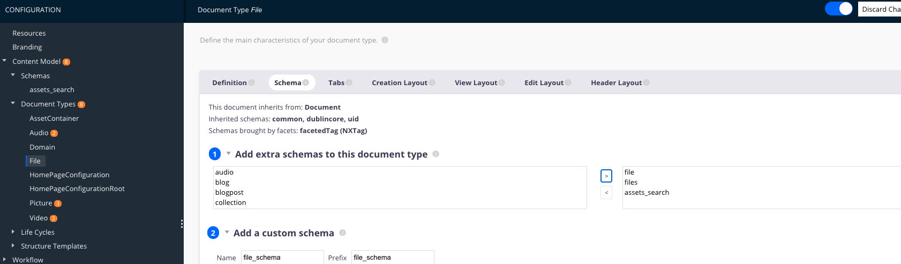
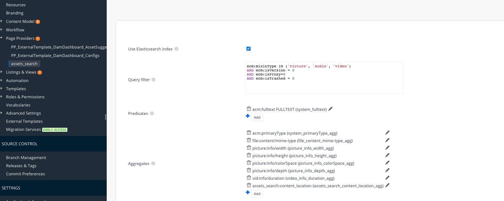

## Description
This plugin provides an example for how to index a document's parent location so that users can search for a 
Nuxeo document via it's location in the repository

## Usage

This plugin assumes the OOTB File doctype is being utilized. When a File doctype is created or modified in any way, 
its parent path will be indexed into a custom string property assets_search:content_location. The schema is defined
in a sandbox studio project that is not publicly available. See screenshots below for more information on how to setup
the schema and a page provider to work for you in your own studio project.

New property in the custom `assets_search` schema


Schema added to `File`


Custom PP with an aggregate for the content location ie `assets_search:content_location`


The custom indexing occurs in a [custom ES Document Writer](https://github.com/nuxeo-sandbox/nuxeo-content-location-search/blob/master/nuxeo-content-location-search-core/src/main/java/contentlocation/core/es/ContentESDocumentWriter.java)

## Requirements
Building requires the following software:
- git
- maven

## How to build
```
git clone https://github.com/nuxeo-sandbox/nuxeo-content-location-search
cd nuxeo-content-location-search
mvn clean install
```

## Deploying
- Install the marketplace package from the admin center or using nuxeoctl

# Support

**These features are not part of the Nuxeo Production platform.**

These solutions are provided for inspiration and we encourage customers to use them as code samples and learning resources.

This is a moving project (no API maintenance, no deprecation process, etc.) 
If any of these solutions are found to be useful for the Nuxeo Platform in general, 
they will be integrated directly into platform, not maintained here.

# License

[Apache License, Version 2.0](http://www.apache.org/licenses/LICENSE-2.0.html)

# About Nuxeo

Nuxeo Platform is an open source Content Services platform, written in Java. Data can be stored in both SQL & NoSQL databases.

The development of the Nuxeo Platform is mostly done by Nuxeo employees with an open development model.

The source code, documentation, roadmap, issue tracker, testing, benchmarks are all public.

Typically, Nuxeo users build different types of information management solutions for [document management](https://www.nuxeo.com/solutions/document-management/), [case management](https://www.nuxeo.com/solutions/case-management/), and [digital asset management](https://www.nuxeo.com/solutions/dam-digital-asset-management/), use cases. It uses schema-flexible metadata & content models that allows content to be repurposed to fulfill future use cases.

More information is available at [www.nuxeo.com](https://www.nuxeo.com).
